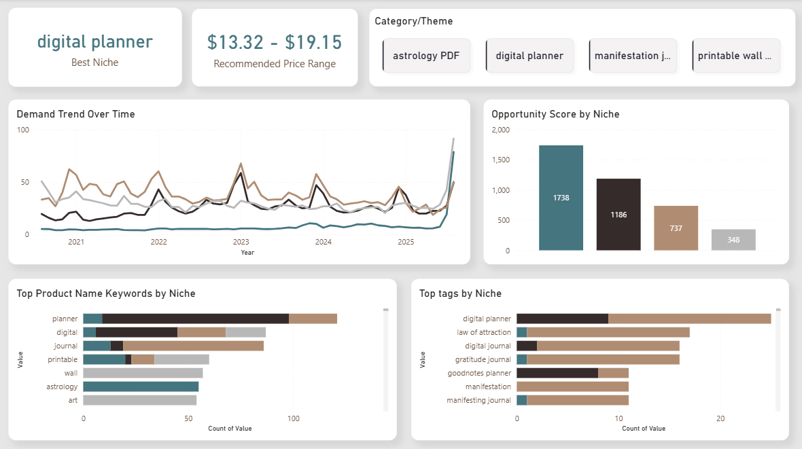

# etsy-market-analysis
A data analysis project identifying high-opportunity digital products on Etsy using Power BI.

# Data-Backed Strategy for Winning Digital Products on Etsy

## 📊 Project Overview
This project analyzes the Etsy digital product marketplace to identify the most viable niche for a new seller. By leveraging web scraping, Google Trends data, and Power BI, I developed a framework to cut through market noise and provide a data-driven launch strategy focused on **demand, profitability, and discoverability**.

**Key Questions Answered:**
1.  Which niche has consistent demand vs. seasonal trends?
2.  What price points maximize conversion and profit margin?
3.  Which keywords and tags are critical for product visibility?

## 🛠️ Tools & Technologies
- **Data Collection:** Web Scraping, Google Trends API
- **Data Cleaning & Processing:** Microsoft Excel, Power Query
- **Data Analysis & Visualization:** Power BI (DAX, Data Modeling)
- **Reporting:** Canva for final presentation

## 🔍 Methodology & Analysis
I followed a structured 3-step framework to evaluate each niche:

1.  **Demand Filter:** Calculated an "Average Demand Score" using Google Trends data to identify niches with sustained, year-round interest.
2.  **Value Filter:** Engineered a "Value Index" (`AVERAGE(Rating) * AVERAGE(Price)`) to find niches where customers reward quality with higher prices.
3.  **Opportunity Filter:** Combined these metrics into a final "Opportunity Score" to pinpoint the optimal niche balancing demand and profitability.

## 📈 Key Insights
- **Winning Niche:** Digital Planners emerged as the optimal choice due to its evergreen demand and high Value Index.
- **Optimal Price Range:** $13 - $19 (Targeting the Q2-Q3 quartile to maximize margin and signal quality).
- **Critical Keywords:** Top tags include `digital planner`, `goodnotes`, `ipad`, `2025`, `undated`, and `minimalist`.

## 📄 Final Deliverable
The full case study presentation, which walks through the problem, framework, analysis, and strategic recommendations, can be viewed here:
**[Project_Report.pdf](Project_Report.pdf)**

**Dashboard Preview:**

## 💡 Conclusion & Impact
This analysis provides a replicable framework for validating product ideas on Etsy. The final strategy de-risks the launch process by replacing guesswork with data-backed decisions on niche selection, pricing, and marketing, ultimately increasing the potential for sustainable profitability.

---
*For any questions or collaboration inquiries, please feel free to connect with me on [LinkedIn](https://www.linkedin.com/in/purvashi-shah/)* or contact me via [email](mailto:purvashi.shah.2003.@gmail.com).
